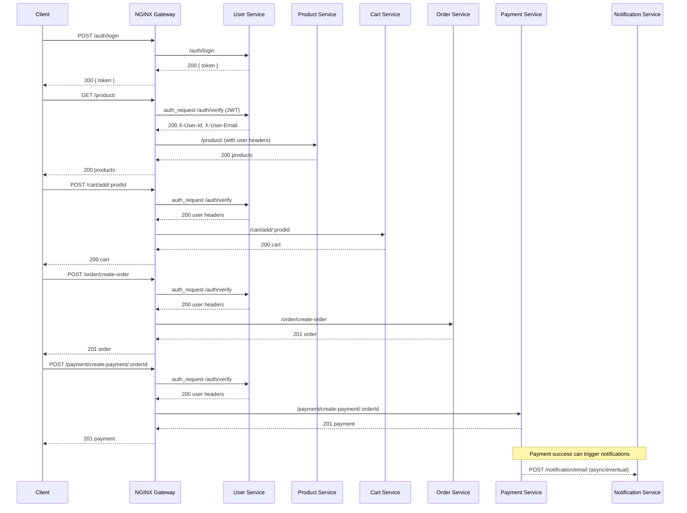

## Scalable E‑Commerce Microservices


Production‑style e‑commerce backend built with Node.js, Express, MongoDB, and
Docker. The system is decomposed into independent services (auth, product, cart,
order, payment, notification) and fronted by NGINX for routing and centralized
auth.

### Why this project stands out

- **Microservices architecture**: Independently deployable services with clear
  bounded contexts
- **API Gateway with centralized auth**: NGINX `auth_request` gating protected
  routes
- **Infrastructure as code**: `docker-compose` local orchestration +
  volume‑backed MongoDB
- **Security**: JWT‑based auth, per‑request user propagation via headers
- **Extensibility**: Each service exposes a clean REST surface and can scale
  horizontally

### Architecture

- **Gateway**: NGINX reverse proxy on port 80; proxies to each service (`/auth`,
  `/product`, `/cart`, `/order`, `/payment`, `/notification`).
- **Services** (all Express + MongoDB):
  - `user-service` (Auth): registration, login, token verification
  - `product-service`: product CRUD and listing
  - `cart-service`: manage user cart
  - `order-service`: create and track orders
  - `payment-service`: create and fetch payments
  - `notification-service`: send notifications (e.g., email)
- **Database**: Single MongoDB instance for local dev (port 27017) with data
  volume

#### Request flow (high level)



### Local development (Docker)

```bash
docker compose up --build
```

Services will be available through the gateway at `http://localhost`.

### Service ports (internal) and gateway routes

- `user-service` → 5000 → `/auth/*`
- `product-service` → 5001 → `/product/*` (protected)
- `cart-service` → 5002 → `/cart/*` (protected)
- `order-service` → 5003 → `/order/*` (protected)
- `payment-service` → 5004 → `/payment/*` (protected)
- `notification-service` → 5005 → `/notification/*` (protected)
- `mongo` → 27017
- `nginx` → 80 (public entrypoint)

### Authentication and request context

- Public endpoints live under `/auth/*`.
- Protected routes use NGINX `auth_request` which calls `/auth/verify` and, on
  success, injects user identity headers for downstream services:
  - `X-User-Id`
  - `X-User-Email`

### REST API

All endpoints below are exposed through the gateway at `http://localhost`.

#### Auth (`/auth`)

- `POST /auth/register` → Create user
- `POST /auth/login` → Login and receive JWT
- `GET /auth/verify` → Verify token (used by gateway)

#### Products (`/product`) [protected]

- `POST /product/create` → Create product
- `GET /product/` → List products
- `GET /product/:prodId` → Get product by ID
- `DELETE /product/:prodId` → Delete product

#### Cart (`/cart`) [protected]

- `POST /cart/add/:prodId` → Add product to cart
- `DELETE /cart/remove/:prodId` → Remove product from cart
- `DELETE /cart/remove-cart` → Clear current user cart
- `GET /cart/` → Get current user cart

#### Orders (`/order`) [protected]

- `POST /order/create-order` → Create order from cart
- `GET /order/` → Get current user orders
- `PUT /order/update-status/:orderId` → Update order status

#### Payments (`/payment`) [protected]

- `POST /payment/create-payment/:orderId` → Create payment for order
- `GET /payment/:paymentId` → Get payment by ID
- `GET /payment/:orderId` → Get payment for order (note: path conflict with
  `:paymentId`; consider namespacing e.g., `/by-id/:paymentId` and
  `/by-order/:orderId`)

#### Notifications (`/notification`) [protected]

- `POST /notification/email/` → Send email notification

### Quick start (without Docker)

For any service:

1. `cd <service-name>`
2. `npm install`
3. Create `.env` with:
   - `PORT=<service-port>` (matches compose: 5000..5005)
   - `MONGO_URI=mongodb://localhost:27017/<db-name>`
   - For `user-service`: add `JWT_SECRET=<your-secret>` if used by your
     controller
4. `npm start`

Run NGINX separately or call services directly on their ports during
development.

### Testing

- Each service can define its own tests; examples are present in
  `user-service/test/` and `product-service/test/`.
- CI runs `npm test` inside each matrix service with a local MongoDB service.
- Local test run example:
  ```bash
  cd user-service
  MONGODB_URI=mongodb://localhost:27017/testdb JWT_SECRET=devsecret npm test
  ```

### Tech stack

- Node.js, Express, MongoDB, Mongoose
- NGINX (reverse proxy + centralized auth), Docker Compose

### CI/CD

- **Build & Test**: GitHub Actions runs unit tests on push
  (`.github/workflows/build-and-test.yaml`).
  - Matrix over services (currently `user-service`, `product-service`) with a
    MongoDB service.
  - Uses Node.js 20, `npm ci`, then `npm test` with `MONGODB_URI` and
    `JWT_SECRET` envs.
- **Build & Push Images**: Manual workflow builds and pushes Docker images for
  all services to Docker Hub (`build-and-push.yaml`).
  - Requires `DOCKER_USERNAME` and `DOCKER_PASSWORD` repo secrets.
  - Tags: `<docker-username>/<service>:latest`.
- **Deploy to Kubernetes (AWS EKS)**: Manual workflow applies each service's
  `deployment.yaml` and `service.yaml` (`deploy.yaml`).
  - Requires `AWS_ACCESS_KEY_ID`, `AWS_SECRET_ACCESS_KEY`, and
    `EKS_CLUSTER_NAME` repo secrets.
  - Installs `kubectl`, updates kubeconfig, then `kubectl apply` per service.

### Kubernetes manifests

- Each service includes `deployment.yaml` and `service.yaml` for K8s deployment
  and exposure.
- To deploy manually if you already have a configured kube-context:
  ```bash
  for d in user-service product-service cart-service order-service payment-service notification-service; do
    kubectl apply -f ./$d/deployment.yaml
    kubectl apply -f ./$d/service.yaml
  done
  ```
  Ensure images referenced by the manifests are available in your registry.

### Notable engineering details

- NGINX `auth_request` pattern centralizes JWT validation and propagates
  identity via headers
- Each service owns its routes, controllers, and models for clarity and
  testability
- Compose files configure dependency ordering and bind mount source for live
  reload in containers

### Production hardening (next steps)

- **Observability**: Structured logs (pino/winston), OpenTelemetry tracing,
  Prometheus metrics, Grafana dashboards
- **Resilience**: Circuit breakers (e.g., opossum), retries with backoff,
  idempotency keys for payments
- **Security**: Rotate `JWT_SECRET`, HTTPS termination, CORS restrictions,
  headers (CSP, HSTS), vault for secrets
- **Data**: Separate databases per service, migrations, backups, and TTL indexes
  for ephemeral docs
- **Gateway**: Rate limiting (token bucket), request/response size limits,
  cached auth decisions
- **Build & Deploy**: Multi-stage Dockerfiles, healthchecks, readiness/liveness
  probes, blue/green or canary
- **CI/CD**: Extend pipelines with linting, vulnerability scans (npm audit,
  Trivy), Snyk; add release tagging and changelog generation
- **Testing**: Contract tests (Pact), integration tests via docker compose, seed
  data

### Known gaps and next steps

- `notification-service/app.js`: fix router import/name and mount path
- `payment-service` routes: resolve overlapping `GET /payment/:id` paths
- Add integration tests and contract tests between gateway and services
- Add rate limiting and request logging at the gateway
- Add linting in CI and production-grade Dockerfiles with healthchecks

### Repository layout

```
cart-service/
notification-service/
order-service/
payment-service/
product-service/
user-service/
docker-compose.yaml
nginx.conf
```

### Sample requests

```bash
# Register
curl -X POST http://localhost/auth/register -H 'Content-Type: application/json' \
  -d '{"email":"a@b.com","password":"secret"}'

# List products (after login; gateway injects user headers)
curl http://localhost/product/

# Add to cart
curl -X POST http://localhost/cart/add/PRODUCT_ID

# Create order
curl -X POST http://localhost/order/create-order

# Create payment
curl -X POST http://localhost/payment/create-payment/ORDER_ID
```

### Author

Built for showcasing microservices design, API gateway patterns, and pragmatic
Node.js service development.
